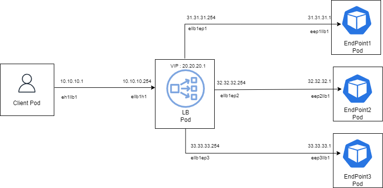

# Creating a simple test topology for loxilb

To test loxilb in a single node cloud-native environment, it is possible to quickly create a test topology. We will explain the steps required to create a very simple topology (more complex topologies can be built using this example) :



Prerequisites :  

* Docker should be preinstalled  
* Pull and run loxilb docker  

```
# docker pull ghcr.io/loxilb-io/loxilb:latest
# docker run -u root --cap-add SYS_ADMIN   --restart unless-stopped --privileged -dit -v /dev/log:/dev/log --name loxilb ghcr.io/loxilb-io/loxilb:latest
```

Next step is to run the following script to create and configure the above topology :

```
#!/bin/bash

docker=$1
HADD="sudo ip netns add "
LBHCMD="sudo ip netns exec loxilb "
HCMD="sudo ip netns exec "

id=`docker ps -f name=loxilb | cut  -d " "  -f 1 | grep -iv  "CONTAINER"`
echo $id
pid=`docker inspect -f '{{.State.Pid}}' $id`
if [ ! -f /var/run/netns/loxilb ]; then
  sudo touch /var/run/netns/loxilb
  sudo mount -o bind /proc/$pid/ns/net /var/run/netns/loxilb
fi

$HADD ep1
$HADD ep2
$HADD ep3
$HADD h1

## Configure load-balancer end-point ep1
sudo ip -n loxilb link add ellb1ep1 type veth peer name eep1llb1 netns ep1
sudo ip -n loxilb link set ellb1ep1 mtu 9000 up
sudo ip -n ep1 link set eep1llb1 mtu 7000 up
$LBHCMD ip addr add 31.31.31.254/24 dev ellb1ep1
$HCMD ep1 ifconfig eep1llb1 31.31.31.1/24 up
$HCMD ep1 ip route add default via 31.31.31.254
$HCMD ep1 ifconfig lo up

## Configure load-balancer end-point ep2
sudo ip -n loxilb link add ellb1ep2 type veth peer name eep2llb1 netns ep2
sudo ip -n loxilb link set ellb1ep2 mtu 9000 up
sudo ip -n ep2 link set eep2llb1 mtu 7000 up
$LBHCMD ip addr add 32.32.32.254/24 dev ellb1ep2
$HCMD ep2 ifconfig eep2llb1 32.32.32.1/24 up
$HCMD ep2 ip route add default via 32.32.32.254
$HCMD ep2 ifconfig lo up

## Configure load-balancer end-point ep3
sudo ip -n loxilb link add ellb1ep3 type veth peer name eep3llb1 netns ep3
sudo ip -n loxilb link set ellb1ep3 mtu 9000 up
sudo ip -n ep3 link set eep3llb1 mtu 7000 up
$LBHCMD ip addr add 17.17.17.254/24 dev ellb1ep3
$HCMD ep3 ifconfig eep3llb1 17.17.17.1/24 up
$HCMD ep3 ip route add default via 17.17.17.254
$HCMD ep3 ifconfig lo up

## Configure load-balancer end-point h1
sudo ip -n loxilb link add ellb1h1 type veth peer name eh1llb1 netns h1
sudo ip -n loxilb link set ellb1h1 mtu 9000 up
sudo ip -n h1 link set eh1llb1 mtu 7000 up
$LBHCMD ip addr add 100.100.100.254/24 dev ellb1h1
$HCMD h1 ifconfig eh1llb1 100.100.100.1/24 up
$HCMD h1 ip route add default via 100.100.100.254
$HCMD h1 ifconfig lo up
```

Finally, we need to configure load-balancer rule inside loxilb docker as follows :
```
docker exec -it loxilb bash
root@8b74b5ddc4d2:/# loxicmd create lb 20.20.20.1 --tcp=2020:5001 --endpoints=31.31.31.1:1,32.32.32.1:1,33.33.33.1:1
```

So, we now have loxilb running as a docker pod with 4 hosts connected to it. 3 of the hosts act as load-balancer end-points and 1 of them act as a client. We can run any workloads as we wish inside the host pods and start testing loxilb


