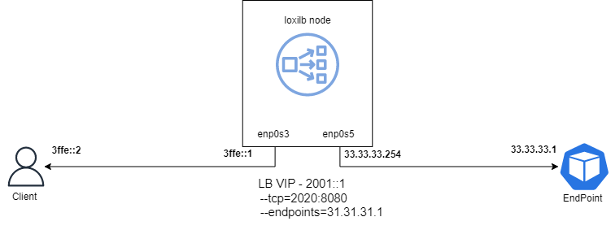

## How to run loxilb in standalone mode

This guide will help users to run loxilb in a standalone mode decoupled from kubernetes.

### Pre-requisites 

*This guide uses Ubuntu 20.04.4 LTS as the base operating system*

#### Install golang    
```
sudo snap install --classic --channel=1.18/stable go
```

#### Install gobgp   
```
wget https://github.com/osrg/gobgp/releases/download/v3.5.0/gobgp_3.5.0_linux_amd64.tar.gz && tar -xzf gobgp_3.5.0_linux_amd64.tar.gz &&  sudo mv gobgp* /usr/sbin/ && rm LICENSE README.md
```

#### Enable IPv6 (if running NAT64/NAT66)   
```
sysctl net.ipv6.conf.all.disable_ipv6=0
sysctl net.ipv6.conf.default.disable_ipv6=0
```

### Install loxilb 

```
wget https://github.com/loxilb-io/loxilb/releases/download/v0.8.2/loxilb_0.8.2-amd64.deb
sudo dpkg -i loxilb_0.8.2-amd64.deb
```

### Setup and Configuration

In this example, the loxilb node has two interfaces -  enp0s3 and enp0s5. “enp0s3” for serving incoming requests and “enp0s5” for internal end-points. The topology is as follows:



The configuration can be simply done as follows:   
```
ip addr add 3ffe::1/64 dev enp0s3
ip addr add 2001::1/128 dev lo   ## Not 2001::1 is the LB service VIP
ip addr add 33.33.33.254/24 dev enp0s5
```
Any other required configuration can be done in a similar way. Now, let's create a LB entry by using the command:   
```
loxicmd create lb 2001::1 --tcp=2020:8080 --endpoints=33.33.33.1:1
```
Validate entry is created using the command:   
```
loxicmd get lb -o wide
```

In the above we are using NAT64 with a single end-point. There are various [options](https://github.com/loxilb-io/loxilbdocs/blob/main/docs/cmd.md#load-balancer) to create LB entries in loxilb. 

### Working with gobgp

loxilb works in tandem with gobgp when bgp services  are required. As a first step, create a file gobgp.conf and add the basic necessary fields :

```
[global.config]
  as = 64512
  router-id = "10.10.10.1"

[[neighbors]]
  [neighbors.config]
    neighbor-address = "10.10.10.254"
    peer-as = 64512
```

Copy this file to actual config file used by gobgp :   
```
sudo mkdir -p /etc/gobgp/
sudo gobgp.conf cp -f /etc/gobgp/gobgp.conf
```

The gobgp daemon should pick the configuration. The neighbors can be verified by :

```
gobgp neighbor
```

At run time, there are two ways to change gobgp configuration. Ephemeral configuration can simply be done using “gobgp” command as detailed [here](https://github.com/osrg/gobgp/blob/master/docs/sources/cli-operations.md). If persistence is required, then one can change the gobgp config file /etc/gobgp/gobgp.conf and apply SIGHUP to gobgpd process for loading the edited configuration.

```
pkill -1 gobgpd
```

### Persistent LB entries

To save the created rules across reboots, one can use the following command:  

```
sudo mkdir -p /etc/loxilb/
loxicmd save --lb
```


